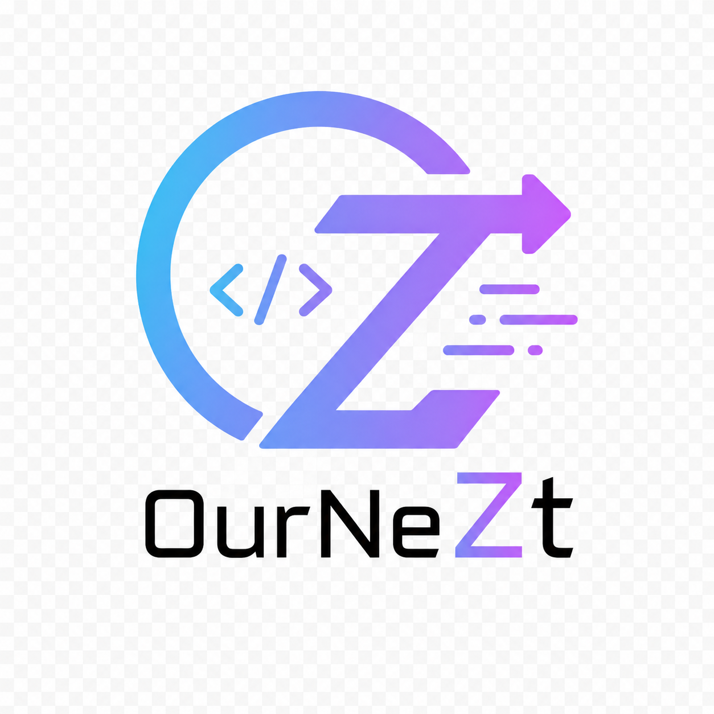

  <!-- Replace with organization logo when available -->
  

<h1 align="center">OurNeZt</h1>

  <strong>A modular platform for financial planning, housing affordability, and household decision support</strong>

  Building practical tools to support long-term financial decisions with clarity, structure, and scalability.

---

## Overview

OurNeZt is a software platform focused on financial planning, housing affordability assessment, and household finance management.

The project is designed to help users better understand their financial position, evaluate major commitments, and plan for long-term goals such as home ownership, savings, budgeting, and future household expenses.

OurNeZt is being developed as a modular ecosystem, with separate services and applications working together through a scalable and maintainable architecture.

---

## Why OurNeZt?

Financial and housing decisions often involve multiple moving parts, including income, savings, expenses, loans, grants, repayment timelines, and long-term affordability.

OurNeZt aims to simplify this planning process by providing structured tools that make financial scenarios easier to understand and compare.

- **Financial Clarity** — Organize income, savings, expenses, and commitments in one place
- **Housing Affordability Planning** — Estimate affordability, upfront costs, repayments, and long-term obligations
- **Scenario-Based Analysis** — Compare different financial and housing options before making decisions
- **Modular Architecture** — Keep core logic, APIs, frontend, and infrastructure independently maintainable
- **Scalable Engineering Approach** — Built with modern backend, frontend, DevOps, and deployment practices

---

## Platform Scope

OurNeZt is expected to support multiple areas of personal and household financial planning, including:

- Budgeting and expense tracking
- Savings goal planning
- Housing affordability calculations
- Loan and repayment estimation
- CPF and cash flow planning
- Scenario comparison
- Financial dashboards and reports
- Future notification and recommendation workflows

---

## Architecture Direction

The platform is planned as a multi-repository system with clear separation of responsibilities.

### Core Services

- Shared domain models
- Protobuf definitions
- Business logic
- Common utilities
- Financial calculation modules

### Backend Services

- Application APIs
- User and household finance workflows
- Data processing
- Authentication and authorization integration
- Service-to-service communication

### Frontend Applications

- Web dashboard
- Planning interfaces
- Financial visualizations
- User-friendly input forms and reports

### Infrastructure

- Containerized deployment
- CI/CD automation
- Environment configuration
- Future Kubernetes deployment support

---

## Technology Direction

OurNeZt is expected to use a modern, service-oriented technology stack.

- **Go** for backend services
- **gRPC** for internal service communication
- **PostgreSQL** for structured data storage
- **Web frontend** for user interaction and dashboards
- **Docker** for containerized development and deployment
- **GitHub Actions** for CI/CD automation
- **Kubernetes** for future scalable deployment

---

## Planned Repositories

The organization may contain repositories such as:

- **`ournezt-core`** — Shared models, protobuf definitions, and core business logic
- **`ournezt-api`** — Backend services and application APIs
- **`ournezt-web`** — Web dashboard and user interface
- **`ournezt-infra`** — Deployment, infrastructure, and environment configuration
- **`ournezt-docs`** — Technical documentation, planning notes, and architecture references

Repository names and responsibilities may evolve as the project matures.

---

## Project Status

OurNeZt is currently in the early design and development phase.

The initial focus is on defining the platform architecture, repository structure, core financial planning logic, and foundational services required to support future application features.

---

## Contributing

Contribution guidelines will be defined as the project structure becomes more stable.

For now, development will focus on establishing the foundation, including core modules, service contracts, documentation, and deployment workflows.

---

## License

Licensing will be defined at the repository level.

---

  Built to support clearer financial and housing decisions.

